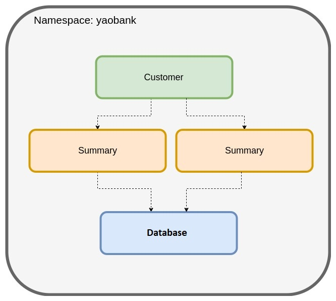

# Lab scenario

This lab is composed of a cluster of three nodes including two worker nodes and a master node. There is also a bastion node from where you access the environment using kubectl/calicoctl and simulate external connectivity. Kubernetes has been preinstalled, but Container Network Interface (CNI) is not installed yet.\
Please note that the node names can change based on you lab instance, but the following node name to IP address mappings stay the same on all the labs.

* Bastion: 10.0.1.10
* Control1(master): 10.0.1.20
* Worker1: 10.0.1.30
* Worker2: 10.0.1.31

To ssh into these nodes, use the following command.
* (ssh NodeName) where node names are (control1/worker1/worker2)


# 1. Install Calico

The first lab guides you through the process of installing Calico and deploying a sample application called Yaobank.

In this lab, you will:
* Install Calico
* Install a sample application (Yaobank)
* Test Yaobank application connectivity


Before getting started, let's enable bash autocomplete for kubectl so that we can easier interact with kubectl.

```
sudo apt-get install bash-completion
source /usr/share/bash-completion/bash_completion
echo 'source <(kubectl completion bash)' >>~/.bashrc
source ~/.bashrc

```


## Install Calico

Since Container Network Interface (CNI) is not installed in this cluster yet, your cluster nodes will appear as NotReady.\
Run the following command to check the status of your nodes. (Note that your lab instance can have a different node names)

```
kubectl get nodes
```

```
NAME                                      STATUS   ROLES                  AGE   VERSION
ip-10-0-1-20.eu-west-1.compute.internal   NotReady    control-plane,master   95m   v1.21.7
ip-10-0-1-30.eu-west-1.compute.internal   NotReady    worker                 94m   v1.21.7
ip-10-0-1-31.eu-west-1.compute.internal   NotReady    worker                 94m   v1.21.7
```

Calico will be the networking (CNI) and network policy provider throughout your training lab. To install Calico, we will use Calico operator, which provides a well-defined API for how you can install, configure, and run Calico.

let's deploy the lastest version of Calico operator by running the following command.

```
kubectl create -f https://raw.githubusercontent.com/projectcalico/calico/v3.25.0/manifests/tigera-operator.yaml

```

Check the operator has been successfully rolled out.

```
kubectl rollout status -n tigera-operator deployment tigera-operator
```
```
$ kubectl rollout status -n tigera-operator deployment tigera-operator
deployment "tigera-operator" successfully rolled out
```

Calico operator uses custom resouces to deploy the required resources for Calico.

For example, Calico operator creates all the the pods in the calico-system namesapce and a number of other resources when it sees the Installation resource in the cluster.

Run the following command to see if there is any resources in the calico-system namesapce. You should see none.

```
kubectl get all -n calico-system
```

Installation resouce is also responsible for certain install time configuration parameters such as IPPOOL configuration, MTU, and etc. For complete info on the Installation resource configurations, please visit the following link.

https://docs.tigera.io/reference/installation/api#operator.tigera.io/v1.Installation

We have customized the installation resource for this lab. We have defined an IPPOOL with the CIDR 10.48.0.0/24. This must be within the range of the pod network CIDR when Kubernetes is bootstrapped. Here we are defining a smaller subnet within the available range as we will be creating additional pools for other purposes in future labs.

Run the following command to find the cluster-cidr (pod-network-cidr) that was used to bootstrap the cluster. You should have a similar output provided below.

```
kubectl cluster-info dump | grep -m 2 -E "service-cluster-ip-range|cluster-cidr"
```
```
$ kubectl cluster-info dump | grep -m 2 -E "service-cluster-ip-range|cluster-cidr"
                            "--service-cluster-ip-range=10.49.0.0/16",
                            "--cluster-cidr=10.48.0.0/16"
```

Now we can apply the following manifest, which will create the the Installation custom resource.

```
kubectl apply -f -<<EOF
# This section includes base Calico installation configuration.
# For more information, see: https://docs.projectcalico.org/v3.21/reference/installation/api#operator.tigera.io/v1.Installation
apiVersion: operator.tigera.io/v1
kind: Installation
metadata:
  name: default
spec:
  # Configures Calico networking.
  calicoNetwork:
    # Note: The ipPools section cannot be modified post-install.
    ipPools:
    - blockSize: 26
      cidr: 10.48.0.0/24
      encapsulation: None
      natOutgoing: Enabled
      nodeSelector: all()
EOF
```

The operator is constantly watching for the Installation resource. Once the operator notices that the Installation resource is created, it will createa a number of resources. Some of these resources to note are the pods that are created in the calico-system namespace. Confirm that all of the pods are running with the following command. Wait untill all the pods are in running state and then hit ctrl+c.

```
watch kubectl get pods -n calico-system
```
```
Every 2.0s: kubectl get pods -n calico-system                                                                                                                                                                                                                                                                                           bastion: Sat Jul  9 03:38:09 2022

NAME                                       READY   STATUS    RESTARTS   AGE
calico-kube-controllers-566754575c-87mms   1/1     Running   0          20m
calico-node-hhjt9                          1/1     Running   0          20m
calico-node-jkdhm                          1/1     Running   0          20m
calico-node-k8x6r                          1/1     Running   0          20m
calico-typha-554986f5d-ldbmx               1/1     Running   0          20m
calico-typha-554986f5d-prkhd               1/1     Running   0          20m
```

Calico also provides an aggregated APIServer, which supports native Kubernetes RBAC and enables you to manage Calico resources using Kubernetes native command line tool (kubectl). To deploy Calico APIServer, we will need to create the following custom resource and the operator deploys the necessay resources in the cluster.

````
kubectl apply -f -<<EOF
# This section configures the Calico API server.
# For more information, see: https://docs.projectcalico.org/v3.21/reference/installation/api#operator.tigera.io/v1.APIServer
apiVersion: operator.tigera.io/v1
kind: APIServer 
metadata: 
  name: default 
spec: {}
EOF

````

Confirm that the APIServer pods are running with the following command. 

```
watch kubectl get pods -n calico-apiserver
```

```
Every 2.0s: kubectl get pods -n calico-apiserver                                                                                                                                                                                                                                                                                        bastion: Sat Jul  9 03:38:38 2022

NAME                                READY   STATUS    RESTARTS   AGE
calico-apiserver-86767b7946-6tfnt   1/1     Running   0          19m
calico-apiserver-86767b7946-77f6z   1/1     Running   0          19m
```

Let's install Calico command line tool called "calicoctl" as a binary in our bastion host.

```
curl -L https://github.com/projectcalico/calico/releases/latest/download/calicoctl-linux-amd64 -o calicoctl
```
```
chmod +x calicoctl
sudo mv calicoctl /usr/local/bin

```

## Install a sample application (Yaobank)

For this lab, we will use a sample application called "Yet Another Online Bank" (yaobank) which consists of 3 microservices.
1. Customer (which provides a simple web GUI)
2. Summary (some middleware business logic)
3. Database (the persistent datastore for the bank)


The following diagram shows the logical diagram of the application.



Install the application using the following commands

```
kubectl apply -f -<<EOF
---
apiVersion: v1
kind: Namespace
metadata:
  name: yaobank
  labels:
    istio-injection: disabled

---
apiVersion: v1
kind: Service
metadata:
  name: database
  namespace: yaobank
  labels:
    app: database
spec:
  ports:
  - port: 2379
    name: http
  selector:
    app: database

---
apiVersion: v1
kind: ServiceAccount
metadata:
  name: database
  namespace: yaobank
  labels:
    app: yaobank

---
apiVersion: apps/v1
kind: Deployment
metadata:
  name: database
  namespace: yaobank
spec:
  selector:
    matchLabels:
      app: database
      version: v1
  replicas: 1
  template:
    metadata:
      labels:
        app: database
        version: v1
    spec:
      serviceAccountName: database
      containers:
      - name: database
        image: calico/yaobank-database:certification
        imagePullPolicy: IfNotPresent
        ports:
        - containerPort: 2379
        command: ["etcd"]
        args:
          - "-advertise-client-urls"
          - "http://database:2379"
          - "-listen-client-urls"
          - "http://0.0.0.0:2379"

---
apiVersion: v1
kind: Service
metadata:
  name: summary
  namespace: yaobank
  labels:
    app: summary
spec:
  ports:
  - port: 80
    name: http
  selector:
    app: summary
    
---
apiVersion: v1
kind: ServiceAccount
metadata:
  name: summary
  namespace: yaobank
  labels:
    app: yaobank
    database: reader
    
---
apiVersion: apps/v1
kind: Deployment
metadata:
  name: summary
  namespace: yaobank
spec:
  replicas: 2
  selector:
    matchLabels:
      app: summary
      version: v1
  template:
    metadata:
      labels:
        app: summary
        version: v1
    spec:
      serviceAccountName: summary
      containers:
      - name: summary
        image: calico/yaobank-summary:certification
        imagePullPolicy: Always
        ports:
        - containerPort: 80
 
---
apiVersion: v1
kind: Service
metadata:
  name: customer
  namespace: yaobank
  labels:
    app: customer
spec:
  type: NodePort
  ports:
  - port: 80
    nodePort: 30180
    name: http
  selector:
    app: customer
    
---
apiVersion: v1
kind: ServiceAccount
metadata:
  name: customer
  namespace: yaobank
  labels:
    app: yaobank
    summary: reader
    
---
apiVersion: apps/v1
kind: Deployment
metadata:
  name: customer
  namespace: yaobank
spec:
  replicas: 1
  selector:
    matchLabels:
      app: customer
      version: v1
  template:
    metadata:
      labels:
        app: customer
        version: v1
    spec:
      serviceAccountName: customer
      containers:
      - name: customer
        image: calico/yaobank-customer:certification
        imagePullPolicy: Always
        ports:
        - containerPort: 80
---
EOF

```

Check the status of the pods. Make sure all the pods are in Running status.

```
watch kubectl get pods -n yaobank -o wide
```
```
Every 2.0s: kubectl get pods -n yaobank -o wide                                                                                                                                                                                                                                                                                         bastion: Sat Jul  9 03:39:17 2022

NAME                        READY   STATUS    RESTARTS   AGE   IP            NODE                                         NOMINATED NODE   READINESS GATES
customer-7955b7b69d-b89bp   1/1     Running   0          16m   10.48.0.195   ip-10-0-1-31.ca-central-1.compute.internal   <none>           <none>
database-67f77d7f54-sn9tk   1/1     Running   0          16m   10.48.0.67    ip-10-0-1-30.ca-central-1.compute.internal   <none>           <none>
summary-748b977d44-7dn2g    1/1     Running   0          16m   10.48.0.68    ip-10-0-1-30.ca-central-1.compute.internal   <none>           <none>
summary-748b977d44-7vzts    1/1     Running   0          16m   10.48.0.194   ip-10-0-1-31.ca-central-1.compute.internal   <none>           <none>
```


## Test Yaobank application connectivity

For now, the application we deployed is only accesible from outside the cluster through a NodePort. We can try the following port on any of the cluster nodes to access the customer pod, which is the frontend app. Following is trying the NodePort on the master node.

```
curl 10.0.1.20:30180
```
```
<!DOCTYPE html PUBLIC "-//W3C//DTD XHTML 1.0 Transitional//EN"
  "http://www.w3.org/TR/xhtml1/DTD/xhtml1-transitional.dtd">

<html xmlns="http://www.w3.org/1999/xhtml">
  <head>
    <title>YAO Bank</title>
    <style>
    h2 {
      font-family: Arial, Helvetica, sans-serif;
    }
    h1 {
      font-family: Arial, Helvetica, sans-serif;
    }
    p {
      font-family: Arial, Helvetica, sans-serif;
    }
    </style>
  </head>
  <body>
        <h1>Welcome to YAO Bank</h1>
        <h2>Name: Spike Curtis</h2>
        <h2>Balance: 2389.45</h2>
        <p><a href="/logout">Log Out >></a></p>
  </body>
</html>
```

In later labs, we will be deploying an ingress controller, which is the recommended way to direct traffic to web applications.
