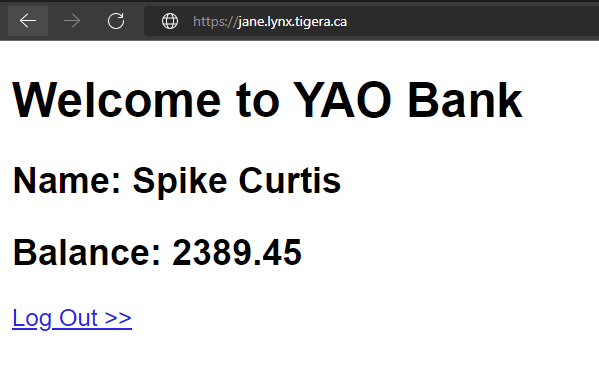

## 3.3. Kubernetes Service - Advanced Services Lab

This is the 3rd of a series of labs about k8s services. This lab exposes the Yaobank Customer service to the outside via ingress controller. In this lab, you will: 

* Remove previous yaobank namespace
* Deploy an ingress controller that listens to all namespaces
* Deploy an updated yaobank manifest including ingress
* Lab cleanup


### Before you begin

This lab builds on top of the previous labs. Please make sure you have completed all the previous labs before starting this lab.

### Remove previous yaobank namespace

In this lab, we will be exposing the Yaobank Customer service using ingress controller. Let's start with removing the previous yaobank deployment and proceed to deploying the new configuration. For simplicity, let's just remove the namespace, which deletes all included objects. It might take 1-2 minutes for the namespace to get deleted. Please wait until the namespace is deleted.

```
kubectl delete ns yaobank
```

### Deploy an ingress controller that listens to all namespaces

Ingress is the built-in kubernetes framework for load-balancing http traffic. Cloud providers offer a similar functionality out of the box via cloud load-balancers. Ingress allows the manipulation of incoming http requests, natting/routing traffic to back-end services based on provided host/path, or even passing-through traffic. It can effectively provide L7-based policies and typical load-balancing features such as stickiness, health probes, or weight-based load-balancing.


Let's start with examining the already deployed ingress controller.

```
kubectl get all -n ingress-nginx
```

```
NAME                                       READY   STATUS      RESTARTS   AGE
pod/ingress-nginx-admission-create-r4zr4   0/1     Completed   0          8h
pod/ingress-nginx-admission-patch-g2vsb    0/1     Completed   0          8h
pod/ingress-nginx-controller-4ssll         1/1     Running     0          7h17m
pod/ingress-nginx-controller-xhj56         1/1     Running     0          7h17m

NAME                                         TYPE        CLUSTER-IP     EXTERNAL-IP   PORT(S)   AGE
service/ingress-nginx-controller-admission   ClusterIP   10.49.72.138   <none>        443/TCP   8h

NAME                                      DESIRED   CURRENT   READY   UP-TO-DATE   AVAILABLE   NODE SELECTOR            AGE
daemonset.apps/ingress-nginx-controller   2         2         2       2            2           kubernetes.io/os=linux   8h

NAME                                       COMPLETIONS   DURATION   AGE
job.batch/ingress-nginx-admission-create   1/1           71m        8h
job.batch/ingress-nginx-admission-patch    1/1           71m        8h
```

Key things to look in the output are:

* The ingress has been deployed as a DaemonSet to be run on each of the worker nodes, so you must have two of them running.
* The ingress controller uses a service of type ClusterIP listening on port 443.

Nginx ingress controller, by default, listens to all namespaces. Once an Ingress object is created in any namespace, it will create the necessary rules to forward the traffic. This default behaviour can be modified to limit ingress controller to a specific namespace.

Currently we have not created any ingress resource yet. So if we try to access our lab instance on port 443 using our browser `https:\\<LabName>.lynx.tigera.ca`, we will get a 404 error from our ingress controller.


### Deploy an updated yaobank manifest including ingress

Let's check our modified yaobank application, which includes an ingress resource at the end of the manifest.


```
kubectl apply -f -<<EOF
apiVersion: v1
kind: Namespace
apiVersion: v1
metadata:
  name: yaobank
  labels:
    istio-injection: disabled

---
apiVersion: v1
kind: Service
metadata:
  name: database
  namespace: yaobank
  labels:
    app: database
spec:
  ports:
  - port: 2379
    name: http
  selector:
    app: database
---
apiVersion: v1
kind: ServiceAccount
metadata:
  name: database
  namespace: yaobank
  labels:
    app: yaobank
---
apiVersion: apps/v1
kind: Deployment
metadata:
  name: database
  namespace: yaobank
spec:
  replicas: 1
  selector:
    matchLabels:
      app: database
      version: v1
  template:
    metadata:
      labels:
        app: database
        version: v1
    spec:
      serviceAccountName: database
      containers:
      - name: database
        image: calico/yaobank-database:certification
        imagePullPolicy: IfNotPresent
        ports:
        - containerPort: 2379
        command: ["etcd"]
        args:
          - "-advertise-client-urls"
          - "http://database:2379"
          - "-listen-client-urls"
          - "http://0.0.0.0:2379"
---
apiVersion: v1
kind: Service
metadata:
  name: summary
  namespace: yaobank
  labels:
    app: summary
spec:
  ports:
  - port: 80
    name: http
  selector:
    app: summary
---
apiVersion: v1
kind: ServiceAccount
metadata:
  name: summary
  namespace: yaobank
  labels:
    app: yaobank
    database: reader
---
apiVersion: apps/v1
kind: Deployment
metadata:
  name: summary
  namespace: yaobank
spec:
  replicas: 2
  selector:
    matchLabels:
      app: summary
      version: v1
  template:
    metadata:
      labels:
        app: summary
        version: v1
    spec:
      serviceAccountName: summary
      containers:
      - name: summary
        image: calico/yaobank-summary:certification
        imagePullPolicy: Always
        ports:
        - containerPort: 80
---
apiVersion: v1
kind: Service
metadata:
  name: customer
  namespace: yaobank
  labels:
    app: customer
spec:
  ports:
  - port: 80
    name: http
  selector:
    app: customer
---
apiVersion: v1
kind: ServiceAccount
metadata:
  name: customer
  namespace: yaobank
  labels:
    app: yaobank
    summary: reader
---

apiVersion: apps/v1
kind: Deployment
metadata:
  name: customer
  namespace: yaobank
spec:
  replicas: 1
  selector:
    matchLabels:
      app: customer
      version: v1
  template:
    metadata:
      labels:
        app: customer
        version: v1
    spec:
      serviceAccountName: customer
      containers:
      - name: customer
        image: calico/yaobank-customer:certification
        imagePullPolicy: Always
        ports:
        - containerPort: 80
---

apiVersion: networking.k8s.io/v1
kind: Ingress
metadata:
  annotations:
    kubernetes.io/ingress.class: "nginx"
  name: ingress-yaobank-customer
  namespace: yaobank
spec:
  rules:
  - host: "yaobank.template.lynx.tigera.ca"
    http:
      paths:
      - path: /
        pathType: Prefix
        backend:
          service:
            name: customer
            port:
              number: 80
EOF

```

Verify that the ingress resource has been successfully deployed.

```
kubectl get ingress -n yaobank
```

```
NAME                       CLASS    HOSTS              ADDRESS               PORTS   AGE
ingress-yaobank-customer   <none>   yaobank.template.lynx.tigera.ca   10.0.1.30,10.0.1.31   80      34s
```
The ingress is created with a generic hostname, but we must match the name used when the lab was deployed, so we will patch it with the command below (substitute the keywork LABNAME with the name of your lab):

```
kubectl patch ingress ingress-yaobank-customer -n yaobank --type='json' -p='[{"op": "replace", "path":"/spec/rules/0/host", "value":"yaobank.<LABNAME>.lynx.tigera.ca"}]'
```

Check the connectivity to the customer service `https:\\yaobank<LabName>.lynx.tigera.ca` via your browser. 



Note we do not use a NodePort service anymore for our customer application in this last manifest as now we use the ingress to access it.

```
kubectl get svc -n yaobank
```

```
NAME       TYPE        CLUSTER-IP     EXTERNAL-IP   PORT(S)    AGE
customer   ClusterIP   10.49.61.230   <none>        80/TCP     5m54s
database   ClusterIP   10.49.230.94   <none>        2379/TCP   5m54s
summary    ClusterIP   10.49.216.86   <none>        80/TCP     5m54s
```

### Lab cleanup

We will need to use yaobank application using NodePort service in the next lab. Let's delete the yaobank namespace as we will need to deploy it again.

```
kubectl delete namespace yaobank
```

> Congratulations! You have successfully completed your k8s services training module.
